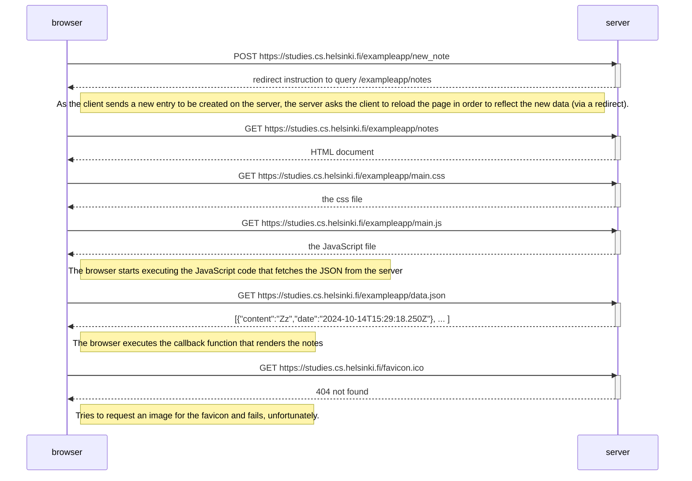

```mermaid
  sequenceDiagram
      participant browser
      participant server

      browser->>server: POST https://studies.cs.helsinki.fi/exampleapp/new_note
      activate server
      server-->>browser: redirect instruction to query /exampleapp/notes
      deactivate server

      Note right of browser: As the client sends a new entry to be created on the server, the server asks the client to reload the page in order to reflect the new data (via a redirect).

      browser->>server: GET https://studies.cs.helsinki.fi/exampleapp/notes
      activate server
      server-->>browser: HTML document
      deactivate server

      browser->>server: GET https://studies.cs.helsinki.fi/exampleapp/main.css
      activate server
      server-->>browser: the css file
      deactivate server

      browser->>server: GET https://studies.cs.helsinki.fi/exampleapp/main.js
      activate server
      server-->>browser: the JavaScript file
      deactivate server

      Note right of browser: The browser starts executing the JavaScript code that fetches the JSON from the server

      browser->>server: GET https://studies.cs.helsinki.fi/exampleapp/data.json
      activate server
      server-->>browser: [{"content":"Zz","date":"2024-10-14T15:29:18.250Z"}, ... ]
      deactivate server

          Note right of browser: The browser executes the callback function that renders the notes

      browser->>server: GET https://studies.cs.helsinki.fi/favicon.ico
      activate server
      server-->>browser: 404 not found
      deactivate server

      Note right of browser: Tries to request an image for the favicon and fails, unfortunately.
```
