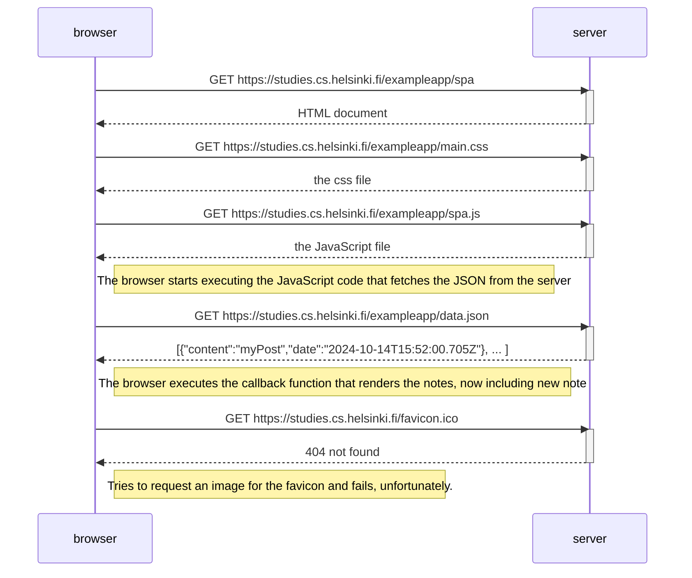

```mermaid
  sequenceDiagram
      participant browser
      participant server

      browser->>server: GET https://studies.cs.helsinki.fi/exampleapp/spa
      activate server
      server-->>browser: HTML document
      deactivate server

      browser->>server: GET https://studies.cs.helsinki.fi/exampleapp/main.css
      activate server
      server-->>browser: the css file
      deactivate server

      browser->>server: GET https://studies.cs.helsinki.fi/exampleapp/spa.js
      activate server
      server-->>browser: the JavaScript file
      deactivate server

      Note right of browser: The browser starts executing the JavaScript code that fetches the JSON from the server

      browser->>server: GET https://studies.cs.helsinki.fi/exampleapp/data.json
      activate server
      server-->>browser: [{"content":"myPost","date":"2024-10-14T15:52:00.705Z"}, ... ]
      deactivate server

          Note right of browser: The browser executes the callback function that renders the notes, now including new note

      browser->>server: GET https://studies.cs.helsinki.fi/favicon.ico
      activate server
      server-->>browser: 404 not found
      deactivate server

      Note right of browser: Tries to request an image for the favicon and fails, unfortunately.

```
